# Sisop-4-2025-IT10

## Member

| No  | Nama                   | NRP        |
| --- | ---------------------- | ---------- |
| 1   | Ardhi Putra Pradana    | 5027241022 |
| 2   | Aslam Ahmad Usman      | 5027241074 |
| 3   | Kanafira Vanesha Putri | 5027241010 |

## Reporting

### Soal 1

**Dikerjakan oleh: Aslam Ahmad Usman (5027241074)**

**Penjelasan**

**Output**

### Soal 2

**Dikerjakan oleh: Ardhi Putra Pradana (5027241022)**

**Penjelasan**

a.

Pertama adalah membuat fuse basic operation dari structnya terlebih dahulu dan mendefinisikan base foldernya yaitu yaitu seperti berikut:

```c
static struct fuse_operations xmp_oper = {
    .getattr = xmp_getattr,
    .readdir = xmp_readdir,
    .create = xmp_create,
    .write = xmp_write,
    .release = xmp_release,
    .read = xmp_read,
    .unlink = xmp_unlink,
};

#define BASE_FOLDER "relics"

int main(int argc, char *argv[]) {
    umask(0);

    return fuse_main(argc, argv, &xmp_oper, NULL);
    return 0;
}
```

b.

Selanjutnya adalah menerapkan fungsi - fungsi untuk bisa menggabungkan setiap fragmentasi file yang ada di target folder **relics**.

```c
char *fullpath(const char *path, const char *base) {
    char *cwd = getcwd(NULL, 0);
    if (cwd == NULL) return NULL;

    char *full_path = malloc(strlen(cwd) + strlen(base) + strlen(path) + 3);
    if (full_path == NULL) {
        free(cwd);
        return NULL;
    }

    sprintf(full_path, "%s/%s/%s", cwd, base, path[0] == '/' ? path + 1 : path);
    free(cwd);

    return full_path;
}
```

Function diatas nantinya akan sering sekali digunakan untuk bisa membuat sebuah path yang relative terhadap _working directory_ program dijalankan.

Pertama adalah implementasi untuk operation _getattr_

```c
static int xmp_getattr(const char *path, struct stat *stbuf) {
    if (strcmp(path, "/") == 0) {
        char *fpath = fullpath(path, BASE_FOLDER);
        int res = lstat(fpath, stbuf);
        free(fpath);
        if (res == -1) return -errno;
        return 0;
    }

    DIR *dp = opendir(fullpath("/", BASE_FOLDER));
    if (dp == NULL) return -errno;

    struct dirent *de;
    off_t total_size = 0;
    struct stat st;
    int found = 0;

    while ((de = readdir(dp)) != NULL) {
        if (strncmp(de->d_name, path + 1, strlen(path) - 1) == 0) {
            char *dot = strrchr(de->d_name, '.');
            if (dot && strlen(dot + 1) == 3) {
                char *fpath = fullpath(de->d_name, BASE_FOLDER);
                if (stat(fpath, &st) == 0) {
                    total_size += st.st_size;
                    if (!found) {
                        stbuf->st_mode = st.st_mode;
                        stbuf->st_uid = st.st_uid;
                        stbuf->st_gid = st.st_gid;
                        stbuf->st_atime = st.st_atime;
                        stbuf->st_mtime = st.st_mtime;
                        found = 1;
                    }
                }
                free(fpath);
            }
        }
    }

    closedir(dp);
    if (!found) return -ENOENT;
    stbuf->st_size = total_size;
    stbuf->st_nlink = 1;

    return 0;
}
```

Operation handler diatas digunakan untuk bisa menampilkan detail - detail dari sebuah file atau folder mounting tersebut seperti _permission, owner file, time, dll_ yang akan ditampilkan nantinya.
Singkatnya function diatas akan mencoba untuk bisa menggabungkan atau melakukan identify dari path yang diberikan untuk dicocokkan ke setiap _fragment_ yang ada difolder **relics**, yang nantinya outputnya akan sesuai dan sinkron dengan setiap _fragmentasi_ atau pecahan - pecahan file yang ada.

Selanjutnya adalah operation untuk _readdir_

```c
static int xmp_readdir(const char *path, void *buf, fuse_fill_dir_t filler, off_t offset, struct fuse_file_info *fi) {
    filler(buf, ".", NULL, 0);
    filler(buf, "..", NULL, 0);

    char *full_path = fullpath(path, BASE_FOLDER);

    DIR *dp = opendir(full_path);
    if (dp == NULL) return -errno;

    struct dirent *de;
    char last_base[NAME_MAX] = {0};

    while ((de = readdir(dp)) != NULL) {
        if (strcmp(de->d_name, ".") == 0 || strcmp(de->d_name, "..") == 0) continue;
        if (de->d_type == DT_DIR) continue;

        char temp[NAME_MAX];
        strncpy(temp, de->d_name, NAME_MAX);
        temp[NAME_MAX - 1] = '\0';

        char *last_dot = strrchr(temp, '.');
        if (last_dot && strlen(last_dot + 1) == 3 &&
            isdigit(last_dot[1]) && isdigit(last_dot[2]) && isdigit(last_dot[3])) {
            *last_dot = '\0';
        }

        if (strcmp(temp, last_base) == 0) continue;
        strcpy(last_base, temp);

        struct stat st;
        memset(&st, 0, sizeof(st));
        st.st_ino = de->d_ino;
        st.st_mode = de->d_type << 12;

        if (filler(buf, temp, &st, 0)) break;
    }

    closedir(dp);
    return 0;
}
```

Operation diatas digunakan untuk melakukan handle ketika terjadi operasi untuk membaca directory didalam folder mounting tersebut. Seperti yang sudah diketahui bahwa diharuskan untuk bisa memunculkan atau menampilkan file yang utuh dari setiap pecahan - pecahan yang ada. Oleh karena itu dihandler tersebut maka akan mencoba membaca 1 nama file dari pecahan - pecahan yang ada untuk dijadikan sebagai sample dari file yang utuh dan menghilangkan angka pecahannya.

Selanjutnya adalah handler untuk operation _read_

```c
static int compare_fragments(const void *a, const void *b) {
    return strcmp(*(const char **)a, *(const char **)b);
}
static int xmp_read(const char *path, char *buf, size_t size, off_t offset, struct fuse_file_info *fi) {
    char message[512];
    snprintf(message, sizeof(message), "READ: %s", path + 1);
    logger(message, 1, 1);

    DIR *dp = opendir(fullpath("/", BASE_FOLDER));
    if (dp == NULL) return -errno;

    struct dirent *de;
    off_t total_offset = 0;
    int bytes_read = 0;

    char *fragments[100];
    int fragment_count = 0;

    while ((de = readdir(dp)) != NULL) {
        char *dot = strrchr(de->d_name, '.');
        if (!dot || strlen(dot + 1) != 3) continue;

        if (strncmp(de->d_name, path + 1, strlen(path) - 1) == 0) {
            fragments[fragment_count] = strdup(de->d_name);
            fragment_count++;
        }
    }
    closedir(dp);

    if (fragment_count == 0) return -ENOENT;

    qsort(fragments, fragment_count, sizeof(char *), compare_fragments);

    for (int i = 0; i < fragment_count; i++) {
        char *fragment_path = fullpath(fragments[i], BASE_FOLDER);

        struct stat st;
        if (stat(fragment_path, &st) == -1) {
            for (int j = 0; j < fragment_count; j++) free(fragments[j]);
            return -errno;
        }

        FILE *fragment_file = fopen(fragment_path, "rb");
        if (!fragment_file) {
            for (int j = 0; j < fragment_count; j++) {
                free(fragments[j]);
            }
            return -errno;
        }
        free(fragment_path);

        if (total_offset + st.st_size <= offset) {
            total_offset += st.st_size;
            fclose(fragment_file);
            continue;
        }

        if (offset > total_offset) fseek(fragment_file, offset - total_offset, SEEK_SET);

        size_t to_read = size - bytes_read;
        size_t read_bytes = fread(buf + bytes_read, 1, to_read, fragment_file);
        bytes_read += read_bytes;

        total_offset += read_bytes;

        fclose(fragment_file);

        if (bytes_read >= size) break;
    }

    for (int i = 0; i < fragment_count; i++) free(fragments[i]);

    if (bytes_read == 0) return -EIO;

    return bytes_read;
}
```

Operation diatas digunakan ketika user membuka atau membaca file yang bersangkutan, seperti sebelumnya operasi akan mencoba untuk menggabungkan setiap data - data yang ada dipecahan - pecahannya untuk bisa menjadi satu kesatuan dan menjadi file yang utuh menjadi satu.

c.

Kemudian adalah mengimplementasikan handler - handler untuk bisa membuat atau memasukkan file ke mounting point fuse nya dan membaginya juga ke tiap - tiap pecahan.

Pertama ada operasi untuk _create_

```c
static int xmp_create(const char *path, mode_t mode, struct fuse_file_info *fi) {
    char *fpath = fullpath(path, BASE_FOLDER);

    struct stat st;
    if (stat(fpath, &st) == 0) {
        free(fpath);
        return -EEXIST;
    }

    FILE *file = fopen(fpath, "wb");
    if (file == NULL) {
        free(fpath);
        return -errno;
    }
    fclose(file);
    free(fpath);

    return 0;
}
```

Operasi diatas sangatlah simple, dimana memang tujuan dari operasi _create_ hanya untuk membuat filenya saja, dan untuk melakukan logic untuk menulis content ke dalam filenya akan dihandle oleh operation _write_ berikut

```c
static int xmp_write(const char *path, const char *buf, size_t size, off_t offset, struct fuse_file_info *fi) {
    if (offset <= 0) {
        char message[512];
        snprintf(message, sizeof(message), "WRITE: %s", path + 1);
        logger(message, 0, 1);
    }

    const char *filename = strrchr(path, '/');
    if (filename == NULL)
        filename = path;
    else
        filename++;

    size_t bytes_written = 0;
    size_t current_offset = offset;
    int fragment_number = current_offset / 1024;

    while (bytes_written < size) {
        size_t fragment_offset = current_offset % 1024;
        size_t to_write = 1024 - fragment_offset;
        if (to_write > size - bytes_written) {
            to_write = size - bytes_written;
        }

        char fragment_name[NAME_MAX];
        snprintf(fragment_name, sizeof(fragment_name), "%s.%03d", filename, fragment_number);
        char *fpath = fullpath(fragment_name, BASE_FOLDER);

        FILE *fragment = fopen(fpath, "r+b");
        if (!fragment) {
            char message[512];
            sprintf(message, " %s", fragment_name);
            logger(message, 0, 0);

            fragment = fopen(fpath, "w+b");
            if (!fragment) {
                free(fpath);
                return -errno;
            }
        }

        fseek(fragment, fragment_offset, SEEK_SET);
        fwrite(buf + bytes_written, 1, to_write, fragment);
        fclose(fragment);
        free(fpath);

        bytes_written += to_write;
        current_offset += to_write;
        fragment_number++;
    }

    return bytes_written;
}
```

Operasi handler tersebut akan mencoba untuk melakukan menulis konten kedalam sebuah file, dimana setiap file tersebut akan dibatas setiap _1KB bytes_ dan menjadi sebuah pecahan - pecahan.

```c

static int xmp_release(const char *path, struct fuse_file_info *fi) {
    char *fpath = fullpath(path, BASE_FOLDER);
    struct stat st;
    if (stat(fpath, &st) == -1) {
        free(fpath);
        return 0;
    }

    if (remove(fpath) == -1) {
        free(fpath);
        return -errno;
    }
    logger("", 1, 0);
    free(fpath);
    return 0;
}
```

Untuk operasi _release_ diaatas digunakan untuk menghapus file asal ketika membuat filenya, karena nantinya file asal tersebut akan digantikan oleh file - file pecahan, dimana tampilan utuhnya sudah dihandle oleh operation _readdir_

d.

Implementasi selanjutnya adalah untuk menghapus file dari folder mounting fuse nya, dan dimana jika dilakukan hal tersebut maka untuk setiap file - file pecahannya akan terhapus juga.

```c
static int xmp_unlink(const char *path) {
    const char *filename = strrchr(path, '/');
    if (!filename)
        filename = path;
    else
        filename++;

    DIR *dp = opendir(fullpath("/", BASE_FOLDER));
    if (!dp) return -errno;

    struct dirent *de;
    int deleted_any = 0;

    char message[2048];
    snprintf(message, sizeof(message), "DELETE: %s -> ", path + 1);

    while ((de = readdir(dp)) != NULL) {
        if (strncmp(de->d_name, filename, strlen(filename)) != 0) continue;

        const char *after = de->d_name + strlen(filename);
        if (after[0] != '.' || strlen(after + 1) != 3) continue;

        if (!isdigit(after[1]) || !isdigit(after[2]) || !isdigit(after[3])) continue;

        snprintf(message + strlen(message), sizeof(message) - strlen(message), "%s ", de->d_name);
        char *fpath = fullpath(de->d_name, BASE_FOLDER);
        if (unlink(fpath) == -1) {
            free(fpath);
            closedir(dp);
            return -errno;
        }

        deleted_any = 1;
        free(fpath);
    }

    closedir(dp);
    if (!deleted_any) return -ENOENT;

    logger(message, 1, 1);

    return 0;
}
```

Handler diatas akan mencoba untuk menghapus semua pecahan atau fragment dari file target yang ada, sehingga semua pecahan dari file yang dimaksud akan ikut hilang atau terhapus.

e.

```c
void logger(const char *message, int withNl, int withTime) {
    FILE *fp = fopen("activity.log", "a");
    if (fp == NULL) return;
    char time_str[32];
    if (withTime) {
        time_t now = time(NULL);
        struct tm *tm_info = localtime(&now);
        strftime(time_str, sizeof(time_str), "%Y-%m-%d %H:%M:%S", tm_info);

        if (withNl) {
            fprintf(fp, "[%s] %s\n", time_str, message);
        } else {
            fprintf(fp, "[%s] %s", time_str, message);
        }
    } else {
        if (withNl) {
            fprintf(fp, "%s\n", message);
        } else {
            fprintf(fp, "%s", message);
        }
    }
    fclose(fp);
}
```

Function diatas digunakan untuk melakukan logging ke file **activity.log**, dimana functiont tersebut sudah dipanggil dibeberapa operasi fuse sebelumnya untuk melakukan logging yang sesuai.

**Output**

1. Fragmentasi menjadi file utuh


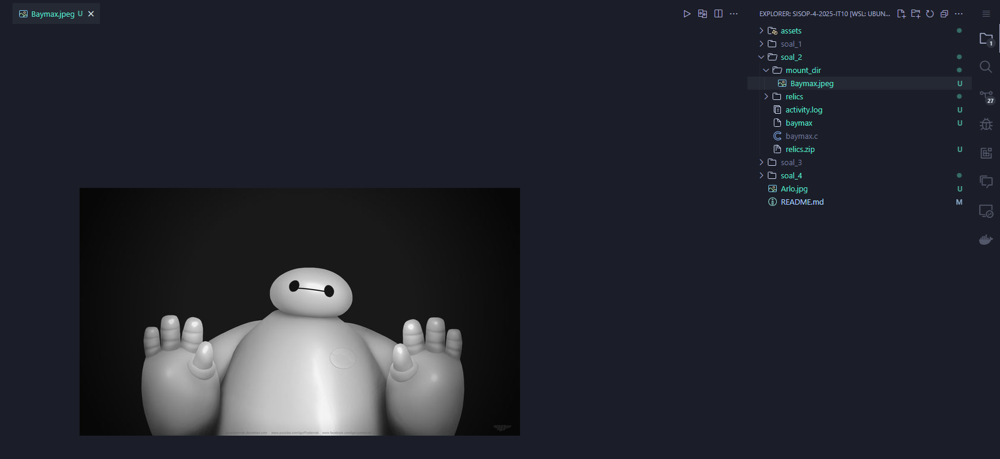

2. Membuat file atau memasukkan file ke mount fuse

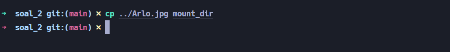

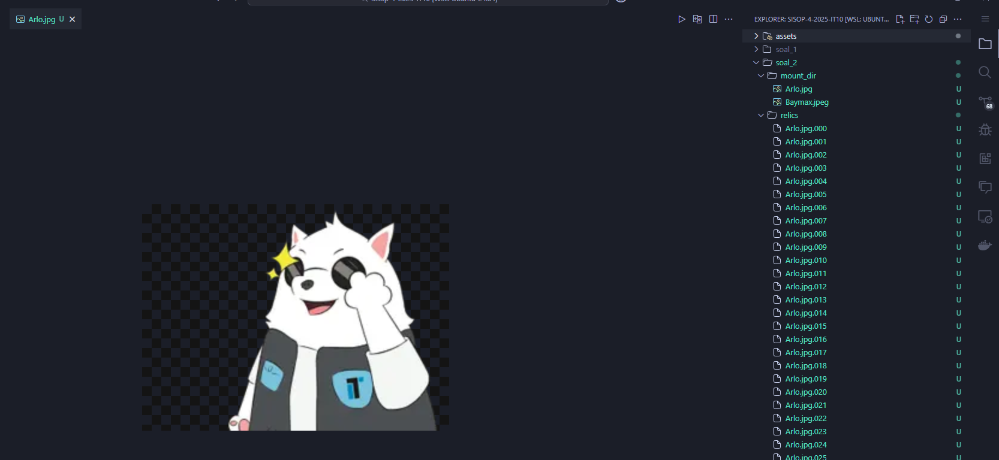

3. Menghapus file dari mount sekaligus pecahannya

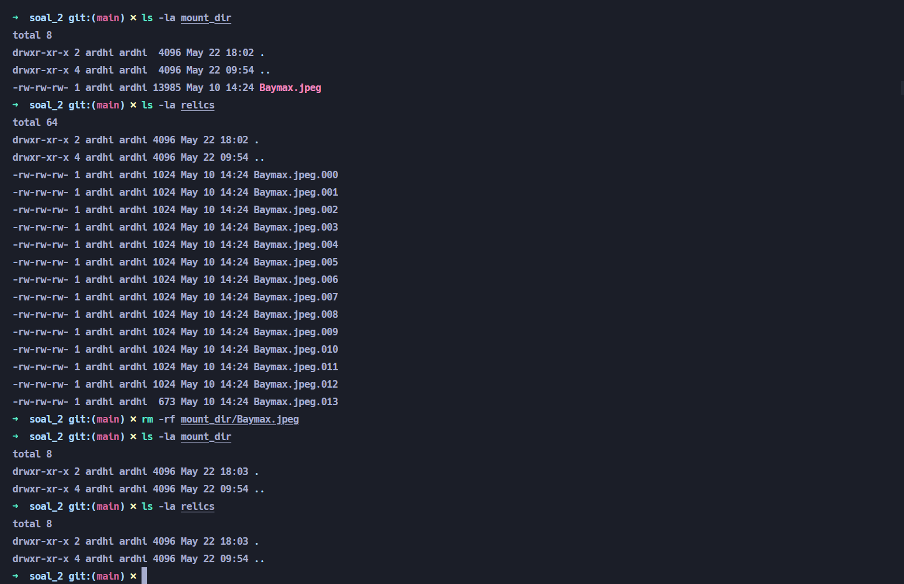

4. Logger ke activity.log

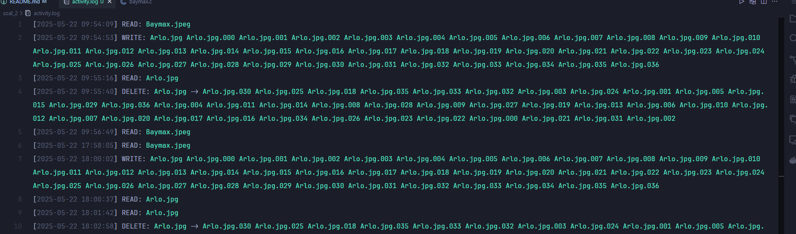

### Soal 3

**Dikerjakan oleh: Kanafira Vanesha Putri (5027241010)**

**Penjelasan**

**Output**

### Soal 4

**Dikerjakan oleh: Ardhi Putra Pradana (5027241022)**

**Penjelasan**

Berikut adalah inisialisasi fuse dan juga beberapa placeholder function untuk setiap operation dan juga helper - helper function yang digunakan

```c
char *fullpath(const char *path, const char *base);
char *mappath(const char *path);
void iv_from_filename(const char *filepath, unsigned char iv[16]);
int aes256_cbc_encrypt(const unsigned char *plaintext, int plaintext_len, const unsigned char *key, const unsigned char *iv, unsigned char **ciphertext);
int aes256_cbc_decrypt(const unsigned char *ciphertext, int ciphertext_len, const unsigned char *key, const unsigned char *iv, unsigned char **plaintext);
int gzip_compress(const unsigned char *in, size_t in_len, unsigned char **out, size_t *out_len);
int gzip_decompress(const unsigned char *in, size_t in_len, unsigned char **out, size_t *out_len);

static int xmp_getattr(const char *path, struct stat *stbuf);
static int xmp_create(const char *path, mode_t mode, struct fuse_file_info *fi);
static int xmp_write(const char *path, const char *buf, size_t size, off_t offset, struct fuse_file_info *fi);
static int xmp_release(const char *path, struct fuse_file_info *fi);
static int xmp_unlink(const char *path);
static int xmp_readdir(const char *path, void *buf, fuse_fill_dir_t filler, off_t offset, struct fuse_file_info *fi);
static int xmp_read(const char *path, char *buf, size_t size, off_t offset, struct fuse_file_info *fi);

struct fuse_operations xmp_oper = {
    .getattr = xmp_getattr,
    .readdir = xmp_readdir,
    .create = xmp_create,
    .write = xmp_write,
    .release = xmp_release,
    .read = xmp_read,
    .unlink = xmp_unlink,
};

#define BASE_FOLDER "chiho"
#define AES_KEY_SIZE 34
#define AES_BLOCK_SIZE 16

const unsigned char AES_KEY[AES_KEY_SIZE] = "SopSopSopSisopAnomaliSistemOperasi";

int main(int argc, char *argv[]) {
    umask(0);
    return fuse_main(argc, argv, &xmp_oper, NULL);
}
```

Untuk beberapa function yang akan sering digunakan adalah function **fullpath** dan **mappath**, yang didefinisikan sebagai berikut ini

```c
char *fullpath(const char *path, const char *base) {
    char *cwd = getcwd(NULL, 0);
    if (cwd == NULL) return NULL;

    char *full_path = malloc(strlen(cwd) + strlen(base) + strlen(path) + 3);
    if (full_path == NULL) {
        free(cwd);
        return NULL;
    }

    sprintf(full_path, "%s/%s/%s", cwd, base, path[0] == '/' ? path + 1 : path);
    free(cwd);

    return full_path;
}

char *mappath(const char *path) {
    char target[PATH_MAX];

    if (strncmp(path, "/starter/", 9) == 0) {
        snprintf(target, sizeof(target), "%s.mai", path);
    } else if (strncmp(path, "/metro/", 7) == 0) {
        snprintf(target, sizeof(target), "%s.ccc", path);
    } else if (strncmp(path, "/dragon/", 8) == 0) {
        snprintf(target, sizeof(target), "%s.rot", path);
    } else if (strncmp(path, "/blackrose/", 11) == 0) {
        snprintf(target, sizeof(target), "%s.bin", path);
    } else if (strncmp(path, "/heaven/", 8) == 0) {
        snprintf(target, sizeof(target), "%s.enc", path);
    } else if (strncmp(path, "/skystreet/", 11) == 0) {
        snprintf(target, sizeof(target), "%s.gz", path);
    } else {
        snprintf(target, sizeof(target), "%s", path);
    }

    return fullpath(target, BASE_FOLDER);
}
```

Function **fullpath** digunakan untuk bisa melakukan reference ke relative path diworking directory saat ini dimana program fuse dijalankan, dan untuk **mappath** digunakan untuk melakukan mapping file asli ke file yang memiliki extension yang sesuai, dimana hal tersebut disesuaikan dengan live foldernya masing - masing.

Next, karena setiap live folder memiliki basic implementation dari semua operation **read, write, create, unlink, getattr, dan readdir** maka penjelasannya akan disatukan dengan operasi yang berkaitan.

1. getattr

```c
static int xmp_getattr(const char *path, struct stat *stbuf) {
    int res;
    char target[PATH_MAX];

    if (strncmp(path, "/7sref/", 7) == 0) {
        char *underscore = strchr(path + 7, '_');
        if (underscore != NULL) {
            size_t len = underscore - path - 6;
            strncpy(target, path + 6, len);
            target[len] = '\0';
            strcat(target, "/");
            strcat(target, path + strlen(path) - strlen(underscore) + 1);
        } else {
            strcpy(target, path);
        }
    } else {
        strcpy(target, path);
    }
    char *map_path = mappath(target);

    res = lstat(map_path, stbuf);
    if (res == -1) {
        char *orig_path = fullpath(path, BASE_FOLDER);
        res = lstat(orig_path, stbuf);
        free(orig_path);
        if (res == -1) {
            free(map_path);
            return -errno;
        }
    }

    free(map_path);
    return 0;
}
```

operation ini sangat simple, dan untuk melakukan mapping ke file yang sesuai maka akan memanggil function dari _mappath_ sebagai acuannya kemudian langsung melakukan **lstat** untuk melakukan read dari attribute yang sesuai, namun jika gagal maka akan melakukan read attribute terhadap file original atau tanpa mapping path nya.

2. create

```c
static int xmp_create(const char *path, mode_t mode, struct fuse_file_info *fi) {
    char *fpath = fullpath(path, BASE_FOLDER);
    struct stat st;
    if (stat(fpath, &st) == 0) {
        free(fpath);
        return -EEXIST;
    }

    FILE *file = fopen(fpath, "wb");
    if (file == NULL) {
        free(fpath);
        return -errno;
    }
    fclose(file);
    free(fpath);
    return 0;
};
```

Tidak ada yang aneh disitu, karena operation create hanya ditujukan untuk membuat filenya saja.

3. write

```c
static int xmp_write(const char *path, const char *buf, size_t size, off_t offset, struct fuse_file_info *fi) {
    char *fpath = fullpath(path, BASE_FOLDER);
    FILE *file = fopen(fpath, "r+b");
    if (!file) {
        file = fopen(fpath, "w+b");
        if (!file) {
            free(fpath);
            return -errno;
        }
    }

    size_t written = 0;
    fseek(file, offset, SEEK_SET);

    if (strncmp(path, "/metro/", 7) == 0) {
        char *encoded = malloc(size);
        if (!encoded) {
            fclose(file);
            free(fpath);
            return -ENOMEM;
        }
        for (size_t i = 0; i < size; i++) {
            encoded[i] = (unsigned char)(buf[i] + (i % 256));
        }
        written = fwrite(encoded, 1, size, file);
        free(encoded);
    } else if (strncmp(path, "/dragon/", 8) == 0) {
        char *encoded = malloc(size);
        if (!encoded) {
            fclose(file);
            free(fpath);
            return -ENOMEM;
        }
        for (size_t i = 0; i < size; i++) {
            if (buf[i] >= 'a' && buf[i] <= 'z') {
                encoded[i] = (buf[i] - 'a' + 13) % 26 + 'a';
            } else if (buf[i] >= 'A' && buf[i] <= 'Z') {
                encoded[i] = (buf[i] - 'A' + 13) % 26 + 'A';
            } else {
                encoded[i] = buf[i];
            }
        }
        written = fwrite(encoded, 1, size, file);
        free(encoded);
    } else if (strncmp(path, "/heaven/", 8) == 0) {
        unsigned char iv[16];
        iv_from_filename(path, iv);

        unsigned char *ciphertext = NULL;
        int ciphertext_len = aes256_cbc_encrypt((unsigned char *)buf, (int)size, AES_KEY, iv, &ciphertext);
        if (ciphertext_len < 0) {
            fclose(file);
            free(fpath);
            return -EIO;
        }

        if (fseek(file, offset, SEEK_SET) != 0) {
            free(ciphertext);
            fclose(file);
            free(fpath);
            return -EIO;
        }

        size_t bytes_written = fwrite(ciphertext, 1, ciphertext_len, file);
        free(ciphertext);

        fclose(file);
        free(fpath);

        if (bytes_written < (size_t)ciphertext_len) return -EIO;
        return size;
    } else if (strncmp(path, "/skystreet/", 11) == 0) {
        unsigned char *compressed = NULL;
        size_t compressed_len = 0;
        int ret = gzip_compress((unsigned char *)buf, size, &compressed, &compressed_len);
        if (ret != Z_OK) {
            fclose(file);
            free(fpath);
            return -EIO;
        }

        written = fwrite(compressed, 1, compressed_len, file);
        free(compressed);

        fclose(file);
        free(fpath);
        return size;
    } else {
        written = fwrite(buf, 1, size, file);
    }

    fclose(file);
    free(fpath);
    if (written < size) return -EIO;
    return written;
};
```

Untuk operation _write_ jika dilihat memiliki handle ke specific beberapa living folder saja yaitu **metro**, **dragon**, **heaven**, **skystreet**, dan jika diluar itu maka akan diwrite sebagai raw content biasa saja, namun untuk setiap targetnya akan dilakukan mapping agar memiliki extension yang sesuai ketika disimpan difolder **chiho**.

Pertama untuk **metro** sangatlah simple hanya melakukan shifting terhadap posisi karakternya

```c
    if (strncmp(path, "/metro/", 7) == 0) {
        char *encoded = malloc(size);
        if (!encoded) {
            fclose(file);
            free(fpath);
            return -ENOMEM;
        }
        for (size_t i = 0; i < size; i++) {
            encoded[i] = (unsigned char)(buf[i] + (i % 256));
        }
        written = fwrite(encoded, 1, size, file);
        free(encoded);
    }
```

Selanjutnya untuk **dragon** melakukan rot13 terhadap raw contentnya

```c
    else if (strncmp(path, "/dragon/", 8) == 0) {
        char *encoded = malloc(size);
        if (!encoded) {
            fclose(file);
            free(fpath);
            return -ENOMEM;
        }
        for (size_t i = 0; i < size; i++) {
            if (buf[i] >= 'a' && buf[i] <= 'z') {
                encoded[i] = (buf[i] - 'a' + 13) % 26 + 'a';
            } else if (buf[i] >= 'A' && buf[i] <= 'Z') {
                encoded[i] = (buf[i] - 'A' + 13) % 26 + 'A';
            } else {
                encoded[i] = buf[i];
            }
        }
        written = fwrite(encoded, 1, size, file);
        free(encoded);
    }
```

Untuk function heaven akan melakukan enkripsi dengan AES CBC 256

```c
    else if (strncmp(path, "/heaven/", 8) == 0) {
        unsigned char iv[16];
        iv_from_filename(path, iv);

        unsigned char *ciphertext = NULL;
        int ciphertext_len = aes256_cbc_encrypt((unsigned char *)buf, (int)size, AES_KEY, iv, &ciphertext);
        if (ciphertext_len < 0) {
            fclose(file);
            free(fpath);
            return -EIO;
        }

        if (fseek(file, offset, SEEK_SET) != 0) {
            free(ciphertext);
            fclose(file);
            free(fpath);
            return -EIO;
        }

        size_t bytes_written = fwrite(ciphertext, 1, ciphertext_len, file);
        free(ciphertext);

        fclose(file);
        free(fpath);

        if (bytes_written < (size_t)ciphertext_len) return -EIO;
        return size;
    }
```

Untuk _iv_ yang digunakan sudah dynamic yaitu dengan melakukan kalkulasi _iv_ dari filename yang dibuat

```c
void iv_from_filename(const char *filepath, unsigned char iv[16]) {
    unsigned char hash[SHA256_DIGEST_LENGTH];
    SHA256((unsigned char *)filepath, strlen(filepath), hash);
    memcpy(iv, hash, 16);
}
```

Lalu handler tersebut akan memanggil function **aes256_cbc_encrypt**

```c
int aes256_cbc_encrypt(const unsigned char *plaintext, int plaintext_len, const unsigned char *key, const unsigned char *iv, unsigned char **ciphertext) {
    EVP_CIPHER_CTX *ctx = EVP_CIPHER_CTX_new();
    if (!ctx) return -1;

    int len;
    int ciphertext_len;

    *ciphertext = malloc(plaintext_len + EVP_MAX_BLOCK_LENGTH);
    if (!*ciphertext) {
        EVP_CIPHER_CTX_free(ctx);
        return -1;
    }

    if (1 != EVP_EncryptInit_ex(ctx, EVP_aes_256_cbc(), NULL, key, iv)) {
        free(*ciphertext);
        EVP_CIPHER_CTX_free(ctx);
        return -1;
    }

    if (1 != EVP_EncryptUpdate(ctx, *ciphertext, &len, plaintext, plaintext_len)) {
        free(*ciphertext);
        EVP_CIPHER_CTX_free(ctx);
        return -1;
    }
    ciphertext_len = len;

    if (1 != EVP_EncryptFinal_ex(ctx, *ciphertext + len, &len)) {
        free(*ciphertext);
        EVP_CIPHER_CTX_free(ctx);
        return -1;
    }
    ciphertext_len += len;

    EVP_CIPHER_CTX_free(ctx);
    return ciphertext_len;
}
```

Next untuk untuk **skystreet** akan melakukan compression ke _gzip_ menggunakan library _zlib_

```c
    else if (strncmp(path, "/skystreet/", 11) == 0) {
        unsigned char *compressed = NULL;
        size_t compressed_len = 0;
        int ret = gzip_compress((unsigned char *)buf, size, &compressed, &compressed_len);
        if (ret != Z_OK) {
            fclose(file);
            free(fpath);
            return -EIO;
        }

        written = fwrite(compressed, 1, compressed_len, file);
        free(compressed);

        fclose(file);
        free(fpath);
        return size;
    }
```

Akan memanggil function **gzip_compress**

```c
int gzip_compress(const unsigned char *in, size_t in_len, unsigned char **out, size_t *out_len) {
    int ret;
    z_stream strm;
    const size_t temp_chunk_size = 8192;

    unsigned char *temp_out = malloc(temp_chunk_size);
    if (!temp_out) return Z_MEM_ERROR;

    *out = NULL;
    *out_len = 0;

    strm.zalloc = Z_NULL;
    strm.zfree = Z_NULL;
    strm.opaque = Z_NULL;

    ret = deflateInit2(&strm, Z_DEFAULT_COMPRESSION, Z_DEFLATED,
                       MAX_WBITS + 16, 8, Z_DEFAULT_STRATEGY);
    if (ret != Z_OK) {
        free(temp_out);
        return ret;
    }

    strm.next_in = (unsigned char *)in;
    strm.avail_in = in_len;

    unsigned char *compressed = NULL;
    size_t total_out = 0;

    do {
        strm.next_out = temp_out;
        strm.avail_out = temp_chunk_size;

        ret = deflate(&strm, strm.avail_in ? Z_NO_FLUSH : Z_FINISH);
        if (ret == Z_STREAM_ERROR) {
            free(compressed);
            free(temp_out);
            deflateEnd(&strm);
            return ret;
        }

        size_t have = temp_chunk_size - strm.avail_out;
        if (have > 0) {
            unsigned char *tmp = realloc(compressed, total_out + have);
            if (!tmp) {
                free(compressed);
                free(temp_out);
                deflateEnd(&strm);
                return Z_MEM_ERROR;
            }
            compressed = tmp;
            memcpy(compressed + total_out, temp_out, have);
            total_out += have;
        }

    } while (ret != Z_STREAM_END);

    deflateEnd(&strm);
    free(temp_out);

    *out = compressed;
    *out_len = total_out;
    return Z_OK;
}
```

4. release

```c
static int xmp_release(const char *path, struct fuse_file_info *fi) {
    char *orig_path = fullpath(path, BASE_FOLDER);
    char *map_path = mappath(path);

    if (rename(orig_path, map_path) == -1) {
        free(orig_path);
        free(map_path);
        return -errno;
    }
    free(orig_path);
    free(map_path);

    return 0;
};
```

Lalu akhirnya akan masuk ke bagian operation _release_ setelah selesai melakukan operation _write_ untuk melakukan renaming file nya sesuai dengan mapping tiap - tiap file tersebut.

5. readdir

```c
static int xmp_readdir(const char *path, void *buf, fuse_fill_dir_t filler, off_t offset, struct fuse_file_info *fi) {
    filler(buf, ".", NULL, 0);
    filler(buf, "..", NULL, 0);

    if (strcmp(path, "/7sref") == 0) {
        char *subdirs[] = {"starter", "metro", "dragon", "blackrose", "heaven", "skystreet"};
        for (int i = 0; i < sizeof(subdirs) / sizeof(subdirs[0]); i++) {
            char *subdirfpath = fullpath(subdirs[i], BASE_FOLDER);
            DIR *dp = opendir(subdirfpath);
            if (dp == NULL) {
                free(subdirfpath);
                continue;
            }

            struct dirent *de;
            while ((de = readdir(dp)) != NULL) {
                if (strcmp(de->d_name, ".") == 0 || strcmp(de->d_name, "..") == 0) continue;
                char *dot = strrchr(de->d_name, '.');
                if (dot != NULL) {
                    size_t new_len = dot - de->d_name;
                    char *modified = strndup(de->d_name, new_len);
                    if (modified == NULL) {
                        closedir(dp);
                        free(subdirfpath);
                        return -ENOMEM;
                    }
                    char prefix[PATH_MAX];
                    sprintf(prefix, "%s_%s", subdirs[i], modified);
                    if (filler(buf, prefix, NULL, 0) != 0) {
                        free(modified);
                        closedir(dp);
                        free(subdirfpath);
                        return -ENOMEM;
                    }
                    free(modified);
                } else {
                    if (filler(buf, de->d_name, NULL, 0) != 0) {
                        closedir(dp);
                        free(subdirfpath);
                        return -ENOMEM;
                    }
                }
            }
            closedir(dp);
            free(subdirfpath);
        }

        return 0;
    }

    char *fpath = fullpath(path, BASE_FOLDER);
    DIR *dp = opendir(fpath);
    if (dp == NULL) {
        free(fpath);
        return -errno;
    }

    struct dirent *de;
    while ((de = readdir(dp)) != NULL) {
        if (strcmp(de->d_name, ".") == 0 || strcmp(de->d_name, "..") == 0) continue;
        char *dot = strrchr(de->d_name, '.');
        if (dot != NULL) {
            size_t new_len = dot - de->d_name;
            char *modified = strndup(de->d_name, new_len);
            if (modified == NULL) {
                closedir(dp);
                free(fpath);
                return -ENOMEM;
            }
            if (filler(buf, modified, NULL, 0) != 0) {
                free(modified);
                closedir(dp);
                free(fpath);
                return -ENOMEM;
            }
            free(modified);
        } else {
            if (filler(buf, de->d_name, NULL, 0) != 0) {
                closedir(dp);
                free(fpath);
                return -ENOMEM;
            }
        }
    }
    closedir(dp);
    free(fpath);
    return 0;
};
```

Untuk operation _readdir_ ini sangat simple hanya membaca ke setiap bagian living folder dan melakukan mapping, namun hal khusus terjadi ketika mengakses folder **7sref** karena harus menampilkan semua hal yang ada di 6 living folder lainnya, oleh karena itu jika terjadi readdir pada bagian **7sref** maka akan dilakukan rewriting target pathnya yang disesuaikan dengan target dari 6 living folder lainnya.

6. Unlink

```c
static int xmp_unlink(const char *path) {
    char target[PATH_MAX];

    if (strncmp(path, "/7sref/", 7) == 0) {
        char *underscore = strchr(path + 7, '_');
        if (underscore != NULL) {
            size_t len = underscore - path - 6;
            strncpy(target, path + 6, len);
            target[len] = '\0';
            strcat(target, "/");
            strcat(target, path + strlen(path) - strlen(underscore) + 1);
        } else {
            strcpy(target, path);
        }
    } else {
        strcpy(target, path);
    }

    char *fpath = mappath(target);
    struct stat st;
    if (stat(fpath, &st) == -1) {
        free(fpath);
        return -ENOENT;
    }
    if (remove(fpath) == -1) {
        free(fpath);
        return -errno;
    }
    free(fpath);
    return 0;
};
```

Untuk unlink implementasinya sangat sederhana, ketika yang diakses dari folder **7sref** maka akan dilakukan rewriting target agar sesuai dengan living folder asal file tersebut, kemudian jika berhasil akan dilakukan _mappath_ untuk mendapatkan path asli dari filenya kemudian menghapusnya.

7. Read

Selanjutnya adalah operation _read_ yang digunakan untuk melakukan read semua file termasuk handler untuk tiap - tiap living folder yang ada.

```c
static int xmp_read(const char *path, char *buf, size_t size, off_t offset, struct fuse_file_info *fi) {
    char target[PATH_MAX];

    if (strncmp(path, "/7sref/", 7) == 0) {
        char *underscore = strchr(path + 7, '_');
        if (underscore != NULL) {
            size_t len = underscore - path - 6;
            strncpy(target, path + 6, len);
            target[len] = '\0';
            strcat(target, "/");
            strcat(target, path + strlen(path) - strlen(underscore) + 1);
        } else {
            strcpy(target, path);
        }
    } else {
        strcpy(target, path);
    }

    char *fpath = mappath(target);
    FILE *file = fopen(fpath, "rb");
    if (!file) {
        free(fpath);
        return -errno;
    }
    fseek(file, offset, SEEK_SET);
    size_t bytes_read = fread(buf, 1, size, file);

    if (strncmp(target, "/metro/", 7) == 0) {
        for (size_t i = 0; i < bytes_read; i++) {
            buf[i] = (unsigned char)(buf[i] - (i % 256));
        }
    } else if (strncmp(target, "/dragon/", 8) == 0) {
        for (size_t i = 0; i < bytes_read; i++) {
            if (buf[i] >= 'a' && buf[i] <= 'z') {
                buf[i] = (buf[i] - 'a' + 13) % 26 + 'a';
            } else if (buf[i] >= 'A' && buf[i] <= 'Z') {
                buf[i] = (buf[i] - 'A' + 13) % 26 + 'A';
            }
        }
    } else if (strncmp(target, "/heaven/", 8) == 0) {
        unsigned char iv[16];
        iv_from_filename(path, iv);

        off_t aligned_offset = offset - (offset % AES_BLOCK_SIZE);
        size_t read_len = size + (offset - aligned_offset) + AES_BLOCK_SIZE;

        FILE *file = fopen(fpath, "rb");
        if (!file) {
            free(fpath);
            return -errno;
        }

        unsigned char *ciphertext = malloc(read_len);
        if (!ciphertext) {
            fclose(file);
            free(fpath);
            return -ENOMEM;
        }

        size_t bytes_read = fread(ciphertext, 1, read_len, file);
        fclose(file);
        free(fpath);

        if (bytes_read == 0) {
            free(ciphertext);
            return 0;
        }

        unsigned char *plaintext = NULL;
        int plaintext_len = aes256_cbc_decrypt(ciphertext, (int)bytes_read, AES_KEY, iv, &plaintext);
        if (plaintext_len < 0) {
            free(ciphertext);
            return -EIO;
        }

        size_t start = offset - aligned_offset;
        if (start > (size_t)plaintext_len) start = plaintext_len;

        size_t to_copy = size;
        if (start + to_copy > (size_t)plaintext_len) {
            to_copy = plaintext_len - start;
        }

        memcpy(buf, plaintext + start, to_copy);
        free(plaintext);

        return (int)to_copy;
    } else if (strncmp(path, "/skystreet/", 11) == 0) {
        fseek(file, 0, SEEK_END);
        long file_size = ftell(file);
        fseek(file, 0, SEEK_SET);

        if (file_size <= 0) {
            fclose(file);
            free(fpath);
            return 0;
        }

        unsigned char *compressed_data = malloc(file_size);
        if (!compressed_data) {
            fclose(file);
            free(fpath);
            return -ENOMEM;
        }

        size_t read_bytes = fread(compressed_data, 1, file_size, file);
        fclose(file);
        free(fpath);

        if (read_bytes != (size_t)file_size) {
            free(compressed_data);
            return -EIO;
        }

        unsigned char *decompressed_data = NULL;
        size_t decompressed_len = 0;

        int ret = gzip_decompress(compressed_data, file_size, &decompressed_data, &decompressed_len);
        free(compressed_data);
        if (ret != Z_OK) {
            free(decompressed_data);
            return -EIO;
        }

        if ((size_t)offset > decompressed_len) {
            free(decompressed_data);
            return 0;
        }

        size_t to_copy = size;
        if (offset + to_copy > decompressed_len) {
            to_copy = decompressed_len - offset;
        }

        memcpy(buf, decompressed_data + offset, to_copy);
        free(decompressed_data);

        return (int)to_copy;
    }

    fclose(file);
    free(fpath);
    return bytes_read;
}
```

Jika dilihat hanya ada beberapa handler khusus untuk beberapa living folder yaitu **7sref, metro, dragon, heaven, skystreet**, dan jika diluar itu maka akan dilakukan read file sederhana atau pada umumnya.

Pertama untuk **7sref** digunakan untuk handler ketika melakukan read dari folder **7sref**, sama seperti sebelumnya yaitu melakukan rewriting path target ke path yang sesuai dengan living folder asal file tersebut.

```c
    if (strncmp(path, "/7sref/", 7) == 0) {
        char *underscore = strchr(path + 7, '_');
        if (underscore != NULL) {
            size_t len = underscore - path - 6;
            strncpy(target, path + 6, len);
            target[len] = '\0';
            strcat(target, "/");
            strcat(target, path + strlen(path) - strlen(underscore) + 1);
        } else {
            strcpy(target, path);
        }
    } else {
        strcpy(target, path);
    }
```

Selanjutnya untuk **metro** digunakan untuk melakukan reversing dari process shifting ketika melakukan write sebelumnya yaitu sebagai berikut ini

```c
    if (strncmp(target, "/metro/", 7) == 0) {
        for (size_t i = 0; i < bytes_read; i++) {
            buf[i] = (unsigned char)(buf[i] - (i % 256));
        }
    }
```

Sama seperti metro untuk **dragon** juga memiliki fungsionalitas untuk melakukan reversing process rot13 dari write sebelumnya

```c
    else if (strncmp(target, "/dragon/", 8) == 0) {
        for (size_t i = 0; i < bytes_read; i++) {
            if (buf[i] >= 'a' && buf[i] <= 'z') {
                buf[i] = (buf[i] - 'a' + 13) % 26 + 'a';
            } else if (buf[i] >= 'A' && buf[i] <= 'Z') {
                buf[i] = (buf[i] - 'A' + 13) % 26 + 'A';
            }
        }
    }
```

Lalu untuk handler **heaven** akan melakukan decrypting dari encryption AES 256 CBC pada process write file tersebut sebelumnya

```c
    else if (strncmp(target, "/heaven/", 8) == 0) {
        unsigned char iv[16];
        iv_from_filename(path, iv);

        off_t aligned_offset = offset - (offset % AES_BLOCK_SIZE);
        size_t read_len = size + (offset - aligned_offset) + AES_BLOCK_SIZE;

        FILE *file = fopen(fpath, "rb");
        if (!file) {
            free(fpath);
            return -errno;
        }

        unsigned char *ciphertext = malloc(read_len);
        if (!ciphertext) {
            fclose(file);
            free(fpath);
            return -ENOMEM;
        }

        size_t bytes_read = fread(ciphertext, 1, read_len, file);
        fclose(file);
        free(fpath);

        if (bytes_read == 0) {
            free(ciphertext);
            return 0;
        }

        unsigned char *plaintext = NULL;
        int plaintext_len = aes256_cbc_decrypt(ciphertext, (int)bytes_read, AES_KEY, iv, &plaintext);
        if (plaintext_len < 0) {
            free(ciphertext);
            return -EIO;
        }

        size_t start = offset - aligned_offset;
        if (start > (size_t)plaintext_len) start = plaintext_len;

        size_t to_copy = size;
        if (start + to_copy > (size_t)plaintext_len) {
            to_copy = plaintext_len - start;
        }

        memcpy(buf, plaintext + start, to_copy);
        free(plaintext);

        return (int)to_copy;
    }
```

Handler tersebut akan memanggil function **aes256_cbc_decrypt** yang implementasinya sebagai berikut ini

```c
int aes256_cbc_decrypt(const unsigned char *ciphertext, int ciphertext_len, const unsigned char *key, const unsigned char *iv, unsigned char **plaintext) {
    EVP_CIPHER_CTX *ctx = EVP_CIPHER_CTX_new();
    if (!ctx) return -1;

    *plaintext = malloc(ciphertext_len);
    if (!*plaintext) {
        EVP_CIPHER_CTX_free(ctx);
        return -1;
    }

    int len = 0, plaintext_len = 0;

    if (1 != EVP_DecryptInit_ex(ctx, EVP_aes_256_cbc(), NULL, key, iv)) goto err;
    if (1 != EVP_DecryptUpdate(ctx, *plaintext, &len, ciphertext, ciphertext_len)) goto err;
    plaintext_len = len;
    if (1 != EVP_DecryptFinal_ex(ctx, *plaintext + len, &len)) goto err;
    plaintext_len += len;

    EVP_CIPHER_CTX_free(ctx);
    return plaintext_len;

err:
    EVP_CIPHER_CTX_free(ctx);
    free(*plaintext);
    *plaintext = NULL;
    return -1;
}
```

Terakhir untuk bagian handler **skystreet** akan melakukan process decompress dari gzip compression dari process write data file sebelumnya

```c
    else if (strncmp(path, "/skystreet/", 11) == 0) {
        fseek(file, 0, SEEK_END);
        long file_size = ftell(file);
        fseek(file, 0, SEEK_SET);

        if (file_size <= 0) {
            fclose(file);
            free(fpath);
            return 0;
        }

        unsigned char *compressed_data = malloc(file_size);
        if (!compressed_data) {
            fclose(file);
            free(fpath);
            return -ENOMEM;
        }

        size_t read_bytes = fread(compressed_data, 1, file_size, file);
        fclose(file);
        free(fpath);

        if (read_bytes != (size_t)file_size) {
            free(compressed_data);
            return -EIO;
        }

        unsigned char *decompressed_data = NULL;
        size_t decompressed_len = 0;

        int ret = gzip_decompress(compressed_data, file_size, &decompressed_data, &decompressed_len);
        free(compressed_data);
        if (ret != Z_OK) {
            free(decompressed_data);
            return -EIO;
        }

        if ((size_t)offset > decompressed_len) {
            free(decompressed_data);
            return 0;
        }

        size_t to_copy = size;
        if (offset + to_copy > decompressed_len) {
            to_copy = decompressed_len - offset;
        }

        memcpy(buf, decompressed_data + offset, to_copy);
        free(decompressed_data);

        return (int)to_copy;
    }
```

Dimana handler diatas akan memanggil function **gzip_decompress** untuk process decompressnya

```c
    int gzip_decompress(const unsigned char *in, size_t in_len, unsigned char **out, size_t *out_len) {
        int ret;
        z_stream strm;
        const size_t temp_chunk_size = 8192;
        unsigned char *temp_out = malloc(temp_chunk_size);
        if (!temp_out) return Z_MEM_ERROR;

        *out = NULL;
        *out_len = 0;

        strm.zalloc = Z_NULL;
        strm.zfree = Z_NULL;
        strm.opaque = Z_NULL;

        // Use inflateInit2 with windowBits = 16 + MAX_WBITS to decode gzip headers
        ret = inflateInit2(&strm, MAX_WBITS + 16);
        if (ret != Z_OK) {
            free(temp_out);
            return ret;
        }

        strm.next_in = (unsigned char *)in;
        strm.avail_in = in_len;

        unsigned char *decompressed = NULL;
        size_t total_out = 0;

        do {
            strm.next_out = temp_out;
            strm.avail_out = temp_chunk_size;

            ret = inflate(&strm, Z_NO_FLUSH);
            if (ret == Z_STREAM_ERROR || ret == Z_DATA_ERROR || ret == Z_MEM_ERROR) {
                free(temp_out);
                free(decompressed);
                inflateEnd(&strm);
                return ret;
            }

            size_t have = temp_chunk_size - strm.avail_out;
            if (have > 0) {
                unsigned char *tmp = realloc(decompressed, total_out + have);
                if (!tmp) {
                    free(decompressed);
                    free(temp_out);
                    inflateEnd(&strm);
                    return Z_MEM_ERROR;
                }
                decompressed = tmp;
                memcpy(decompressed + total_out, temp_out, have);
                total_out += have;
            }

        } while (ret != Z_STREAM_END);

        inflateEnd(&strm);
        free(temp_out);

        *out = decompressed;
        *out_len = total_out;

        return Z_OK;
    }
```

**Output**

1. Struktur awal ketika fuse dijalankan

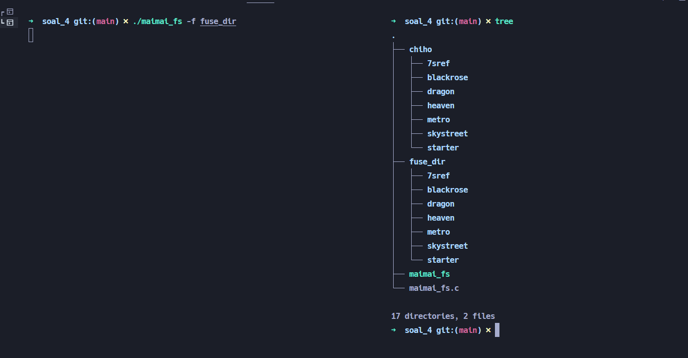

2. Handler untuk folder **starter**

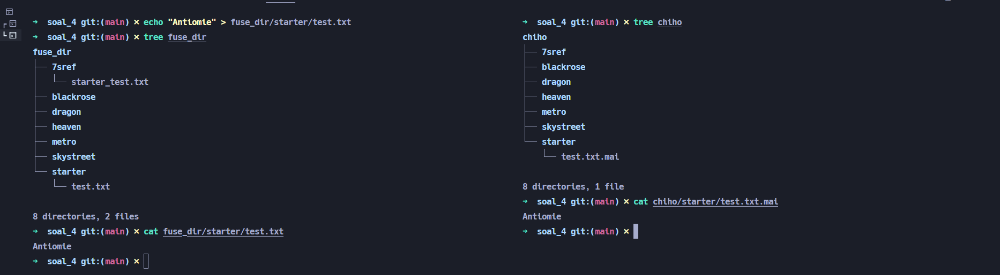

3. Handler untuk folder **metro**

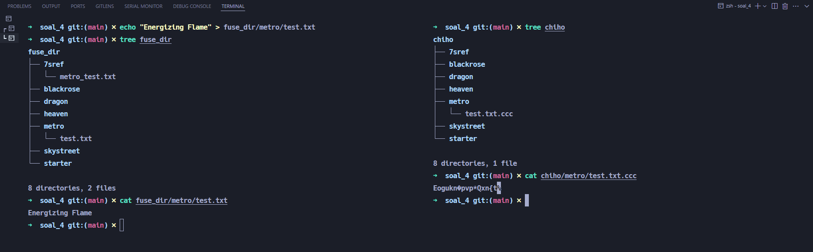

4. Handler untuk folder **dragon**

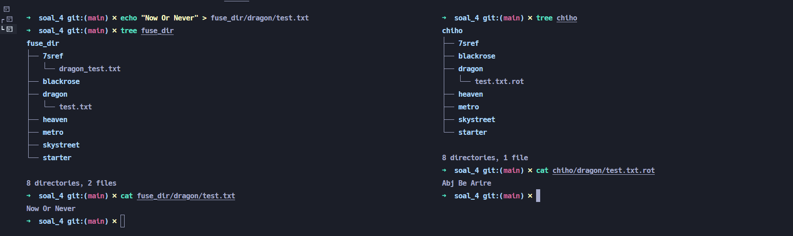

5. Handler untuk folder **blackrose**

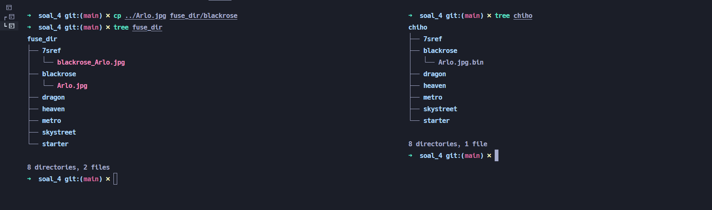
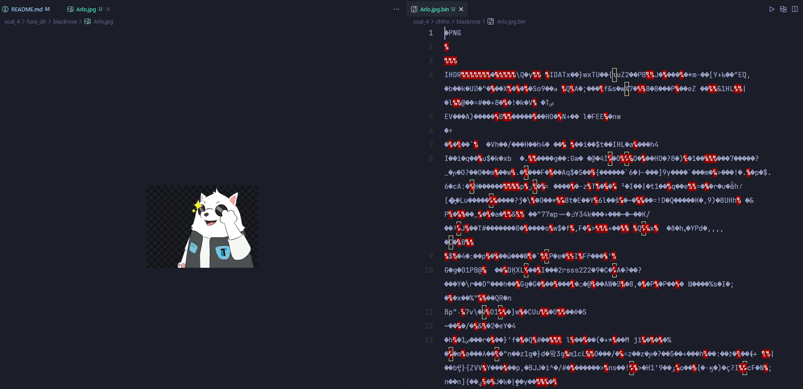

6. Handler untuk folder **heaven**

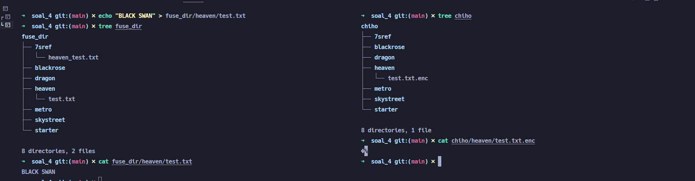

7. Handler untuk folder **skystreet**

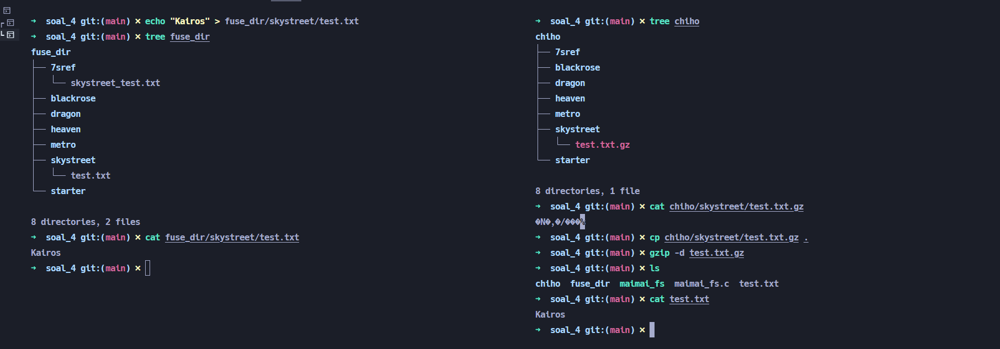

8. Handler untuk folder **7sref**

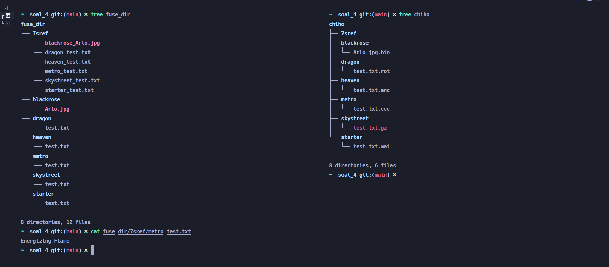
