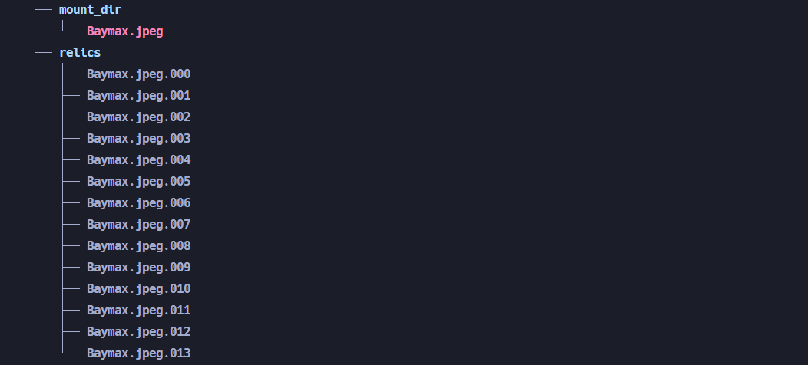

# Sisop-4-2025-IT10

## Member

| No  | Nama                   | NRP        |
| --- | ---------------------- | ---------- |
| 1   | Ardhi Putra Pradana    | 5027241022 |
| 2   | Aslam Ahmad Usman      | 5027241074 |
| 3   | Kanafira Vanesha Putri | 5027241010 |

## Reporting

Soal 1
**Dikerjakan oleh: Aslam Ahmad Usman (5027241074)**

**Penjelasan**

**Output**

Soal 2
**Dikerjakan oleh: Ardhi Putra Pradana (5027241022)**

**Penjelasan**

a.

Pertama adalah membuat fuse basic operation dari structnya terlebih dahulu dan mendefinisikan base foldernya yaitu yaitu seperti berikut:

```c
static struct fuse_operations xmp_oper = {
    .getattr = xmp_getattr,
    .readdir = xmp_readdir,
    .create = xmp_create,
    .write = xmp_write,
    .release = xmp_release,
    .read = xmp_read,
    .unlink = xmp_unlink,
};

#define BASE_FOLDER "relics"

int main(int argc, char *argv[]) {
    umask(0);

    return fuse_main(argc, argv, &xmp_oper, NULL);
    return 0;
}
```

b.

Selanjutnya adalah menerapkan fungsi - fungsi untuk bisa menggabungkan setiap fragmentasi file yang ada di target folder **relics**.

```c
char *fullpath(const char *path, const char *base) {
    char *cwd = getcwd(NULL, 0);
    if (cwd == NULL) return NULL;

    char *full_path = malloc(strlen(cwd) + strlen(base) + strlen(path) + 3);
    if (full_path == NULL) {
        free(cwd);
        return NULL;
    }

    sprintf(full_path, "%s/%s/%s", cwd, base, path[0] == '/' ? path + 1 : path);
    free(cwd);

    return full_path;
}
```

Function diatas nantinya akan sering sekali digunakan untuk bisa membuat sebuah path yang relative terhadap _working directory_ program dijalankan.

Pertama adalah implementasi untuk operation _getattr_

```c
static int xmp_getattr(const char *path, struct stat *stbuf) {
    if (strcmp(path, "/") == 0) {
        char *fpath = fullpath(path, BASE_FOLDER);
        int res = lstat(fpath, stbuf);
        free(fpath);
        if (res == -1) return -errno;
        return 0;
    }

    DIR *dp = opendir(fullpath("/", BASE_FOLDER));
    if (dp == NULL) return -errno;

    struct dirent *de;
    off_t total_size = 0;
    struct stat st;
    int found = 0;

    while ((de = readdir(dp)) != NULL) {
        if (strncmp(de->d_name, path + 1, strlen(path) - 1) == 0) {
            char *dot = strrchr(de->d_name, '.');
            if (dot && strlen(dot + 1) == 3) {
                char *fpath = fullpath(de->d_name, BASE_FOLDER);
                if (stat(fpath, &st) == 0) {
                    total_size += st.st_size;
                    if (!found) {
                        stbuf->st_mode = st.st_mode;
                        stbuf->st_uid = st.st_uid;
                        stbuf->st_gid = st.st_gid;
                        stbuf->st_atime = st.st_atime;
                        stbuf->st_mtime = st.st_mtime;
                        found = 1;
                    }
                }
                free(fpath);
            }
        }
    }

    closedir(dp);
    if (!found) return -ENOENT;
    stbuf->st_size = total_size;
    stbuf->st_nlink = 1;

    return 0;
}
```

Operation handler diatas digunakan untuk bisa menampilkan detail - detail dari sebuah file atau folder mounting tersebut seperti _permission, owner file, time, dll_ yang akan ditampilkan nantinya.
Singkatnya function diatas akan mencoba untuk bisa menggabungkan atau melakukan identify dari path yang diberikan untuk dicocokkan ke setiap _fragment_ yang ada difolder **relics**, yang nantinya outputnya akan sesuai dan sinkron dengan setiap _fragmentasi_ atau pecahan - pecahan file yang ada.

Selanjutnya adalah operation untuk _readdir_

```c
static int xmp_readdir(const char *path, void *buf, fuse_fill_dir_t filler, off_t offset, struct fuse_file_info *fi) {
    filler(buf, ".", NULL, 0);
    filler(buf, "..", NULL, 0);

    char *full_path = fullpath(path, BASE_FOLDER);

    DIR *dp = opendir(full_path);
    if (dp == NULL) return -errno;

    struct dirent *de;
    char last_base[NAME_MAX] = {0};

    while ((de = readdir(dp)) != NULL) {
        if (strcmp(de->d_name, ".") == 0 || strcmp(de->d_name, "..") == 0) continue;
        if (de->d_type == DT_DIR) continue;

        char temp[NAME_MAX];
        strncpy(temp, de->d_name, NAME_MAX);
        temp[NAME_MAX - 1] = '\0';

        char *last_dot = strrchr(temp, '.');
        if (last_dot && strlen(last_dot + 1) == 3 &&
            isdigit(last_dot[1]) && isdigit(last_dot[2]) && isdigit(last_dot[3])) {
            *last_dot = '\0';
        }

        if (strcmp(temp, last_base) == 0) continue;
        strcpy(last_base, temp);

        struct stat st;
        memset(&st, 0, sizeof(st));
        st.st_ino = de->d_ino;
        st.st_mode = de->d_type << 12;

        if (filler(buf, temp, &st, 0)) break;
    }

    closedir(dp);
    return 0;
}
```

Operation diatas digunakan untuk melakukan handle ketika terjadi operasi untuk membaca directory didalam folder mounting tersebut. Seperti yang sudah diketahui bahwa diharuskan untuk bisa memunculkan atau menampilkan file yang utuh dari setiap pecahan - pecahan yang ada. Oleh karena itu dihandler tersebut maka akan mencoba membaca 1 nama file dari pecahan - pecahan yang ada untuk dijadikan sebagai sample dari file yang utuh dan menghilangkan angka pecahannya.

Selanjutnya adalah handler untuk operation _read_

```c
static int compare_fragments(const void *a, const void *b) {
    return strcmp(*(const char **)a, *(const char **)b);
}
static int xmp_read(const char *path, char *buf, size_t size, off_t offset, struct fuse_file_info *fi) {
    char message[512];
    snprintf(message, sizeof(message), "READ: %s", path + 1);
    logger(message, 1, 1);

    DIR *dp = opendir(fullpath("/", BASE_FOLDER));
    if (dp == NULL) return -errno;

    struct dirent *de;
    off_t total_offset = 0;
    int bytes_read = 0;

    char *fragments[100];
    int fragment_count = 0;

    while ((de = readdir(dp)) != NULL) {
        char *dot = strrchr(de->d_name, '.');
        if (!dot || strlen(dot + 1) != 3) continue;

        if (strncmp(de->d_name, path + 1, strlen(path) - 1) == 0) {
            fragments[fragment_count] = strdup(de->d_name);
            fragment_count++;
        }
    }
    closedir(dp);

    if (fragment_count == 0) return -ENOENT;

    qsort(fragments, fragment_count, sizeof(char *), compare_fragments);

    for (int i = 0; i < fragment_count; i++) {
        char *fragment_path = fullpath(fragments[i], BASE_FOLDER);

        struct stat st;
        if (stat(fragment_path, &st) == -1) {
            for (int j = 0; j < fragment_count; j++) free(fragments[j]);
            return -errno;
        }

        FILE *fragment_file = fopen(fragment_path, "rb");
        if (!fragment_file) {
            for (int j = 0; j < fragment_count; j++) {
                free(fragments[j]);
            }
            return -errno;
        }
        free(fragment_path);

        if (total_offset + st.st_size <= offset) {
            total_offset += st.st_size;
            fclose(fragment_file);
            continue;
        }

        if (offset > total_offset) fseek(fragment_file, offset - total_offset, SEEK_SET);

        size_t to_read = size - bytes_read;
        size_t read_bytes = fread(buf + bytes_read, 1, to_read, fragment_file);
        bytes_read += read_bytes;

        total_offset += read_bytes;

        fclose(fragment_file);

        if (bytes_read >= size) break;
    }

    for (int i = 0; i < fragment_count; i++) free(fragments[i]);

    if (bytes_read == 0) return -EIO;

    return bytes_read;
}
```

Operation diatas digunakan ketika user membuka atau membaca file yang bersangkutan, seperti sebelumnya operasi akan mencoba untuk menggabungkan setiap data - data yang ada dipecahan - pecahannya untuk bisa menjadi satu kesatuan dan menjadi file yang utuh menjadi satu.

c.

Kemudian adalah mengimplementasikan handler - handler untuk bisa membuat atau memasukkan file ke mounting point fuse nya dan membaginya juga ke tiap - tiap pecahan.

Pertama ada operasi untuk _create_

```c
static int xmp_create(const char *path, mode_t mode, struct fuse_file_info *fi) {
    char *fpath = fullpath(path, BASE_FOLDER);

    struct stat st;
    if (stat(fpath, &st) == 0) {
        free(fpath);
        return -EEXIST;
    }

    FILE *file = fopen(fpath, "wb");
    if (file == NULL) {
        free(fpath);
        return -errno;
    }
    fclose(file);
    free(fpath);

    return 0;
}
```

Operasi diatas sangatlah simple, dimana memang tujuan dari operasi _create_ hanya untuk membuat filenya saja, dan untuk melakukan logic untuk menulis content ke dalam filenya akan dihandle oleh operation _write_ berikut

```c
static int xmp_write(const char *path, const char *buf, size_t size, off_t offset, struct fuse_file_info *fi) {
    if (offset <= 0) {
        char message[512];
        snprintf(message, sizeof(message), "WRITE: %s", path + 1);
        logger(message, 0, 1);
    }

    const char *filename = strrchr(path, '/');
    if (filename == NULL)
        filename = path;
    else
        filename++;

    size_t bytes_written = 0;
    size_t current_offset = offset;
    int fragment_number = current_offset / 1024;

    while (bytes_written < size) {
        size_t fragment_offset = current_offset % 1024;
        size_t to_write = 1024 - fragment_offset;
        if (to_write > size - bytes_written) {
            to_write = size - bytes_written;
        }

        char fragment_name[NAME_MAX];
        snprintf(fragment_name, sizeof(fragment_name), "%s.%03d", filename, fragment_number);
        char *fpath = fullpath(fragment_name, BASE_FOLDER);

        FILE *fragment = fopen(fpath, "r+b");
        if (!fragment) {
            char message[512];
            sprintf(message, " %s", fragment_name);
            logger(message, 0, 0);

            fragment = fopen(fpath, "w+b");
            if (!fragment) {
                free(fpath);
                return -errno;
            }
        }

        fseek(fragment, fragment_offset, SEEK_SET);
        fwrite(buf + bytes_written, 1, to_write, fragment);
        fclose(fragment);
        free(fpath);

        bytes_written += to_write;
        current_offset += to_write;
        fragment_number++;
    }

    return bytes_written;
}
```

Operasi handler tersebut akan mencoba untuk melakukan menulis konten kedalam sebuah file, dimana setiap file tersebut akan dibatas setiap _1KB bytes_ dan menjadi sebuah pecahan - pecahan.

```c

static int xmp_release(const char *path, struct fuse_file_info *fi) {
    char *fpath = fullpath(path, BASE_FOLDER);
    struct stat st;
    if (stat(fpath, &st) == -1) {
        free(fpath);
        return 0;
    }

    if (remove(fpath) == -1) {
        free(fpath);
        return -errno;
    }
    logger("", 1, 0);
    free(fpath);
    return 0;
}
```

Untuk operasi _release_ diaatas digunakan untuk menghapus file asal ketika membuat filenya, karena nantinya file asal tersebut akan digantikan oleh file - file pecahan, dimana tampilan utuhnya sudah dihandle oleh operation _readdir_

d.

Implementasi selanjutnya adalah untuk menghapus file dari folder mounting fuse nya, dan dimana jika dilakukan hal tersebut maka untuk setiap file - file pecahannya akan terhapus juga.

```c
static int xmp_unlink(const char *path) {
    const char *filename = strrchr(path, '/');
    if (!filename)
        filename = path;
    else
        filename++;

    DIR *dp = opendir(fullpath("/", BASE_FOLDER));
    if (!dp) return -errno;

    struct dirent *de;
    int deleted_any = 0;

    char message[2048];
    snprintf(message, sizeof(message), "DELETE: %s -> ", path + 1);

    while ((de = readdir(dp)) != NULL) {
        if (strncmp(de->d_name, filename, strlen(filename)) != 0) continue;

        const char *after = de->d_name + strlen(filename);
        if (after[0] != '.' || strlen(after + 1) != 3) continue;

        if (!isdigit(after[1]) || !isdigit(after[2]) || !isdigit(after[3])) continue;

        snprintf(message + strlen(message), sizeof(message) - strlen(message), "%s ", de->d_name);
        char *fpath = fullpath(de->d_name, BASE_FOLDER);
        if (unlink(fpath) == -1) {
            free(fpath);
            closedir(dp);
            return -errno;
        }

        deleted_any = 1;
        free(fpath);
    }

    closedir(dp);
    if (!deleted_any) return -ENOENT;

    logger(message, 1, 1);

    return 0;
}
```

Handler diatas akan mencoba untuk menghapus semua pecahan atau fragment dari file target yang ada, sehingga semua pecahan dari file yang dimaksud akan ikut hilang atau terhapus.

e.

```c
void logger(const char *message, int withNl, int withTime) {
    FILE *fp = fopen("activity.log", "a");
    if (fp == NULL) return;
    char time_str[32];
    if (withTime) {
        time_t now = time(NULL);
        struct tm *tm_info = localtime(&now);
        strftime(time_str, sizeof(time_str), "%Y-%m-%d %H:%M:%S", tm_info);

        if (withNl) {
            fprintf(fp, "[%s] %s\n", time_str, message);
        } else {
            fprintf(fp, "[%s] %s", time_str, message);
        }
    } else {
        if (withNl) {
            fprintf(fp, "%s\n", message);
        } else {
            fprintf(fp, "%s", message);
        }
    }
    fclose(fp);
}
```

Function diatas digunakan untuk melakukan logging ke file **activity.log**, dimana functiont tersebut sudah dipanggil dibeberapa operasi fuse sebelumnya untuk melakukan logging yang sesuai.

**Output**

1. Fragmentasi menjadi file utuh




2. Membuat file atau memasukkan file ke mount fuse


3. Menghapus file dari mount sekaligus pecahannya


4. Logger ke activity.log


Soal 3
**Dikerjakan oleh: Kanafira Vanesha Putri (5027241010)**

**Penjelasan**

**Output**

Soal 4
**Dikerjakan oleh: Ardhi Putra Pradana (5027241022)**

**Penjelasan**

**Output**
